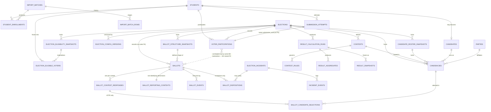

# DOMAIN MODEL PROPOSAL — Phase 1A (Consolidated Revision)

Status: **APPROVED — Phase 1A complete; not yet implemented**
Scope: Domain model and database architecture design only. No migrations, models, controllers, services, policies, or UI were created or modified for this phase.
Revision basis: consolidated review feedback against `README.md`, `CLAUDE.md`, and all files in `docs/`.

This revision keeps every structural decision from the prior draft that was not specifically challenged, and reworks the areas the review identified as under-specified or ambiguous: ballot traceability without re-identification, explicit vote/abstain modeling, reporting-context privacy, snapshot/version consistency, configuration source of truth, the Data Center import domain, authentication/identity mapping, the `candidates` entity, `parties` scoping, MySQL constraint strategy, and identifier strategy. No institutional rule (contest lists, seat counts, sector definitions, retention periods, RPO/RTO, scale targets, small-group suppression thresholds) is invented; all such items are pointed at `docs/OPEN_DECISIONS.md` or flagged in the checklist at the end of this document.

---

## 1. Design principles this model must satisfy

Unchanged from the prior draft, restated from `NON_NEGOTIABLES.md` / `CLAUDE.md`:

1. MySQL is authoritative — every fact needed to reconstruct an election outcome must exist as a committed row.
2. Nothing that can reasonably vary between elections is hard-coded into table structure.
3. Participation and ballot selections are structurally separated, and no normal path connects a ballot to a student.
4. Cast ballots are immutable evidence — incidents are handled by addition, never by edit/delete.
5. Snapshots (config, eligibility, candidate roster, ballot structure) are locked before `OPEN` and are not silently altered by later master-data changes.
6. Finalized elections are immutable in full.
7. Critical uniqueness/integrity rules are enforced by the database wherever MySQL can reasonably express them, with transactional application logic and detective reconciliation covering what MySQL cannot express declaratively.

Added in this revision, per the consolidated review: favor the **simplest** mechanism that gives strong practical protection — schema constraint first, transactional application logic second, detective reconciliation third, database triggers only where the first two genuinely cannot cover a rule and the rule is high-stakes enough to justify the added operational complexity.

---

## 2. Entity inventory

### 2.1 Identity

**`students`** — unchanged from the prior draft: permanent identity (`institutional_id` unique), current master snapshot, `institutional_email` (write-protected), `status` (`ACTIVE`/`INACTIVE` only), `last_import_batch_id`.
Added: `google_subject` (nullable until first login, unique when set) — see §12.

**`student_enrollments`** — unchanged: append-only placement history per import.

**`admin_users`** — unchanged: `google_subject` (unique), `display_name`, fixed `role = BUKSU_COMELEC_IT_ADMIN`.

**`import_batches`** *(new — closes a gap identified in review)*
Backs `students.last_import_batch_id` and `student_enrollments.import_batch_id`, which the prior draft referenced without defining.

- `source_filename`, `academic_year`, `semester`
- `uploaded_by` (FK `admin_users`)
- `status` — `STAGED` / `VALIDATING` / `PREVIEWED` / `CONFIRMED` / `PROCESSING` / `COMPLETED` / `FAILED`, matching the pipeline in `DATA_IMPORT.md` (Upload → Staging → Validation → Preview → Review → Confirm → Chunked Import → Summary)
- `records_received`, `records_created`, `records_updated`, `records_errored` (summary counts)
- `checksum` (of the source file, for integrity/audit)
- `started_at`, `confirmed_at`, `completed_at`

**`import_batch_rows`** *(new, minimal — supports the Preview/Review step only)*
Holds the classification produced during Validation/Preview so admins can review before confirming. This table is transient in nature (rows are only meaningful until the batch is confirmed or discarded) and deliberately kept thin — it is not a second copy of `student_enrollments`.

- `import_batch_id` FK
- `institutional_id` (as read from the file)
- `classification` — `NEW` / `UPDATED` / `DUPLICATE_IN_FILE` / `INVALID` / `NEEDS_EXCEPTION_REVIEW`
- `raw_row_json` (the row as uploaded, for the review screen)
- `resolved_student_id` (nullable FK `students`, set once matched/created)

No further import fields are proposed — anything beyond what `DATA_IMPORT.md` and `STUDENT_MANAGEMENT.md` already require would be inventing institutional structure.

### 2.2 Election configuration

**`elections`** — unchanged: lifecycle `state`, `current_config_version_id`, `locked_config_version_id`, `timezone`, `opens_at`/`closes_at`, `created_by`/`approved_by`.

**`election_config_versions`** — unchanged in shape, but its relationship to normalized config tables is now explicitly resolved — see §10.

**`contests`**, **`contest_rules`**, **`contest_eligibility_rules`**, **`representation_groups`** — unchanged from the prior draft.

**`candidate_roster_snapshots`** *(new — closes a gap identified in review)*
The prior draft referenced `candidacies.roster_snapshot_version` without a concrete entity behind it. This table gives that field somewhere real to point to, consistent with how `election_eligibility_snapshots` already works.

- `election_id` FK, `election_config_version_id` FK
- `version_number`, `status` (`DRAFT` / `LOCKED`), `locked_at`

`candidacies.roster_snapshot_id` (FK, nullable until locked) replaces the previous bare `roster_snapshot_version` field.

**`ballot_structure_snapshots`** *(new — closes a gap identified in review, and is what a ballot now actually references)*
The concrete "what does the ballot look like" snapshot named conceptually in `README.md` §7 but never given a table in the prior draft (which only had a loose `ballot_structure_snapshot_version` string on `ballots`).

- `election_id` FK, `election_config_version_id` FK, `candidate_roster_snapshot_id` FK, `eligibility_snapshot_id` FK
- `version_number`, `status` (`DRAFT` / `LOCKED`), `locked_at`
- `structure_json` — a frozen, denormalized description of the contests/rules/candidates actually presented, kept for reproducibility/audit alongside the normalized rows (same role `config_json` plays for configuration — see §10)

`ballots.ballot_structure_snapshot_id` (FK) replaces the previous string version field.

### 2.3 Candidates

**`candidates`** — kept, with a concrete recommendation now given (was an open question) — see §11.

**`candidacies`** — unchanged in shape, plus `roster_snapshot_id` FK as noted above.

**`parties`** — kept election-scoped, with a concrete recommendation now given (was an open question) — see §12.

### 2.4 Eligibility

**`election_eligibility_snapshots`**, **`election_eligible_voters`**, **`contest_eligibility_rules`** — unchanged from the prior draft. The frozen per-voter attributes captured on `election_eligible_voters` (college/course/year/sector "as of snapshot time") remain the basis for contest eligibility *and* are now also the source for the reporting context described in §7 — the same frozen values are read once, at vote time, and copied in two directions: into the ballot's non-identifying reporting context (no student key retained) and used (but not stored) to validate contest eligibility.

### 2.5 Voting — substantially revised

This is the area the review challenged most directly. The prior draft's single `ballot_items` table (candidate row + `is_abstain` flag) is replaced with an explicit contest-response model, and three new tables are added to give ballots auditable lifecycle/reporting without reintroducing a voter link.

**`submission_attempts`**, **`voter_participations`** — unchanged from the prior draft (idempotency tracking and participation proof respectively; both may reference `student_id`, which is correct and intentional — see §5).

**`ballots`**

- `election_id` FK, `ballot_structure_snapshot_id` FK (replaces the old version string)
- `cast_at`
- `status` — `CAST` only at the row level; exclusion/voiding is handled by `ballot_dispositions` (§5), not by mutating this row.
- **Still carries no `student_id`, no `voter_participation_id`, no `submission_uuid`, no `receipt_code`, and no Google identity of any kind** — this is unchanged and is the core of the secrecy boundary (§5).

**`ballot_contest_responses`** *(new — replaces the ambiguous `is_abstain` flag with an explicit concept, per review item 3)*
Exactly one row per `(ballot_id, contest_id)` — enforced by a database unique constraint, which is the direct structural expression of "every contest receives exactly one explicit response."

- `ballot_id` FK, `contest_id` FK — **unique `(ballot_id, contest_id)`**
- `response_type` — enum `VOTE` / `ABSTAIN` only (no `SKIP` state, per review item 3 — "skip" is UI wording, not a domain value)

**`ballot_candidate_selections`** *(new — replaces candidate rows previously living directly on `ballot_items`)*
Exists only under a `VOTE` response; a contest response of `ABSTAIN` has zero rows here — this is now a structural consequence of the foreign key, not a flag combination that has to be separately validated for consistency.

- `ballot_contest_response_id` FK
- `contest_id` FK (denormalized from the parent response — see §13.3 for why)
- `candidacy_id` FK
- Composite FK `(candidacy_id, contest_id)` → `candidacies(id, contest_id)` (requires a composite unique key on `candidacies`) — this is what guarantees a selection can never reference a candidate who isn't actually running in that contest, purely declaratively (§13.3).
- Unique `(ballot_contest_response_id, candidacy_id)` — prevents selecting the same candidate twice within one contest response.

**`ballot_reporting_contexts`** *(new — non-identifying reporting dimensions, per review item 5)*
One row per ballot, written in the same atomic transaction as the ballot itself.

- `ballot_id` FK, unique
- `election_id` FK
- `frozen_college`, `frozen_course`, `frozen_year_level`, `frozen_sector` (nullable) — copied at vote time from the voter's `election_eligible_voters` snapshot row, **by value, not by reference**; no key back to that voter row is stored here.
- **Explicitly excluded by design**: `student_id`, `institutional_id`, email, `voter_participation_id`, `submission_uuid`, `receipt_code`, or any other voter identifier — none of these columns exist on this table, and none should ever be added to it.

**`ballot_events`** *(new — ballot lifecycle/traceability, per review item 1)*
Answers "what happened to ballot X" without ever being joinable to a student.

- `ballot_id` FK
- `event_type` — e.g. `CREATED`, `INCLUDED_IN_CALCULATION_RUN`, `FLAGGED_FOR_REVIEW`, `DISPOSITION_APPLIED`, `DISPOSITION_REVERSED` (extensible; not exhaustively specified here since it's an operational log, not a rule-bearing table)
- `related_incident_id` (nullable FK `election_incidents`)
- `related_result_calculation_run_id` (nullable FK, for `INCLUDED_IN_CALCULATION_RUN` events)
- `actor_id` (nullable FK `admin_users` — an admin investigating an incident is not a secrecy violation; a **student** identity must never appear here)
- `notes`, `occurred_at`
- **Explicitly excluded by design**: the same identifier list as `ballot_reporting_contexts` above.

**`ballot_dispositions`** *(new — the "separate disposition/adjudication mechanism," per review item 1)*
Append-only. A normal, uncontested ballot has **no row here at all** — absence of a row means "included," which avoids writing a disposition row for every one of potentially tens of thousands of normal ballots. A row is written only for the exceptional case.

- `ballot_id` FK
- `disposition` — `EXCLUDED_FROM_CALCULATION` / `VOIDED` / `REINSTATED`
- `reason`, `related_incident_id` FK `election_incidents`
- `decided_by` FK `admin_users`, `decided_at`
- The **original `ballots` / `ballot_contest_responses` / `ballot_candidate_selections` rows are never edited or deleted** to give effect to a disposition — result calculation (§8) simply reads the latest disposition per ballot (if any) and excludes/includes accordingly. This preserves the original as evidence while still letting COMELEC keep results correct.

**`outbox_events`** — unchanged.

### 2.6 Results — revised for configurable dimensions

`result_calculation_runs` and `result_snapshots` are unchanged in shape. `result_aggregates` is revised — the prior draft left it "unchanged" while describing detailed breakdowns (college/course/year/sector) as something queried live from `ballot_reporting_contexts`; this left no defined mechanism for a *finalized* election's detailed results to be reproduced later without re-deriving them from raw ballots, which contradicts §9's snapshot/reproducibility pattern for everything else in this schema. The revision below closes that gap without adding a separate table per dimension.

**`result_calculation_runs`** — unchanged: `election_id` FK, `algorithm_version`, `ballot_count_at_run`, `status`, `started_at`/`completed_at`, `result_digest`.

**`result_aggregates`** *(revised — one configurable dimension model instead of per-dimension tables)*

- `result_calculation_run_id` FK, `contest_id` (nullable — null for election-wide rows), `candidacy_id` (nullable — null for contest-level or dimension-level totals that aren't about one candidate)
- `metric_type` — enum: `CANDIDATE_VOTE_COUNT`, `CONTEST_ABSTAIN_COUNT`, `CONTEST_PARTICIPATION_COUNT`, `OVERALL_CAST_COUNT`, `OVERALL_PARTICIPATION_COUNT` (extensible; this is an enumerated set of *what is being counted*, not a per-dimension table)
- `dimension_type` — enum: `OVERALL`, `COLLEGE`, `COURSE`, `YEAR_LEVEL`, `SECTOR` (matches the frozen fields already present on `ballot_reporting_contexts`, §2.5; `OVERALL` means no breakdown applied)
- `dimension_value` (nullable string — e.g. the specific college name; null when `dimension_type = OVERALL`)
- `count` (the raw number for this metric/dimension/value combination)
- `denominator_type` (nullable enum — `ELIGIBLE_ELECTION`, `ELIGIBLE_CONTEST`, `PARTICIPATING_CONTEST`, `VOTING_CONTEST`; see §8.1 for what each means and when each applies) and `denominator_value` (nullable — the actual number used) — recorded alongside `count` so a percentage can always be reconstructed exactly as it was calculated, not recomputed later against a possibly-different live denominator
- Unique `(result_calculation_run_id, contest_id, candidacy_id, metric_type, dimension_type, dimension_value)` — prevents two rows silently double-counting the same slice.

This gives every one of the required breakdowns — overall, college, course/program, year, sector, candidate, abstention, participation — as rows differentiated by `metric_type` + `dimension_type` + `dimension_value`, rather than as seven-plus separate tables or seven-plus separate columns that would each need their own migration whenever a new dimension is configured. Adding a new reportable dimension later (if the platform is ever configured with one beyond college/course/year/sector) is a matter of adding an enum value, not a schema migration to a new table.

**`result_snapshots`** *(revised — now explicitly the reproducible official record)*

- `election_id` FK, `result_calculation_run_id` FK
- `status` — `PENDING_VALIDATION` / `VALIDATED` / `OFFICIALLY_ANNOUNCED` / `FINALIZED`
- `snapshot_json` — a full frozen export of the *complete* detailed result set for that run: every `result_aggregates` row that existed at snapshot time, serialized, plus the denominators used. This is the same "normalized-is-authoritative-while-editable, JSON-is-a-frozen-export-once-locked" pattern already established for configuration in §10 — `result_aggregates` rows remain the authoritative, queryable data up to and including `VALIDATED`; at `FINALIZED`, `snapshot_json` becomes the durable, self-contained official record that does not depend on `result_aggregates` rows never being touched by some future maintenance operation. Once `FINALIZED`, `snapshot_json` is never re-derived or edited (§4).

This directly satisfies "the finalized result snapshot must contain/reproduce the complete official detailed result set" — the snapshot is a full export, not a pointer to live aggregate rows that could theoretically be altered later.

### 2.7 Operations

**`audit_logs`**, **`election_incidents`**, **`incident_events`** — unchanged. Note the distinction from the new `ballot_events`/`ballot_dispositions`: `audit_logs`/`election_incidents` are the general-purpose, system-wide operational trail (can reference admins, students-as-subjects-of-an-admin-action, imports, etc.); `ballot_events`/`ballot_dispositions` are a deliberately narrower, ballot-only correlation domain that must never be joined to anything carrying a voter identity. Keeping them as separate tables (rather than folding ballot lifecycle into `audit_logs`) is what makes that separation enforceable by "which table has which columns" rather than by convention alone.

Backup/health metadata tables remain deferred, per the prior draft — see §20 (checklist).

---

## 3. Relationship summary

The dotted relationship between `VOTER_PARTICIPATIONS` and `BALLOTS` remains the crux of the design — see §5. Everything hanging off `BALLOTS` in the lower half of the diagram (`BALLOT_CONTEST_RESPONSES`, `BALLOT_CANDIDATE_SELECTIONS`, `BALLOT_REPORTING_CONTEXTS`, `BALLOT_EVENTS`, `BALLOT_DISPOSITIONS`) forms one self-contained correlation domain, keyed only by `ballot_id`, that never touches a voter-identity-bearing table.

---

## 4. Immutability model

Unchanged in principle from the prior draft; restated with the new tables slotted in.

| State reached                                    | What becomes locked                                                      | Mechanism                                                                                                                                                                                                     |
| ------------------------------------------------ | ------------------------------------------------------------------------ | ------------------------------------------------------------------------------------------------------------------------------------------------------------------------------------------------------------- |
| `election_config_versions.status = SNAPSHOTTED`  | normalized config rows for that version                                  | see §10                                                                                                                                                                                                       |
| `candidate_roster_snapshots.status = LOCKED`     | `candidacies` tied to that snapshot                                      | no normal `UPDATE`/`DELETE`; changes go through a new roster version                                                                                                                                          |
| `election_eligibility_snapshots.status = LOCKED` | `election_eligible_voters` for that snapshot                             | no normal `UPDATE`/`DELETE`; a re-run produces a new snapshot                                                                                                                                                 |
| `ballot_structure_snapshots.status = LOCKED`     | the frozen ballot shape used for `OPEN`                                  | no normal `UPDATE`/`DELETE`                                                                                                                                                                                   |
| `ballots.status = CAST`                          | the ballot, its contest responses, its selections, its reporting context | **no normal `UPDATE`/`DELETE` app code path at all.** The only way to affect a ballot's standing is an additive `ballot_dispositions` row plus a `ballot_events` entry — the original rows are never touched. |
| `elections.state = FINALIZED`                    | everything above, plus results                                           | full write-freeze; a post-finalization issue is a new `election_incidents` row (and, if it concerns a specific ballot, a new `ballot_dispositions`/`ballot_events` row), never a mutation                     |

---

## 5. Ballot secrecy + traceability boundary

Restated and sharpened per review item 1: secrecy and traceability are not in tension once they're recognized as two different, deliberately non-overlapping correlation domains.

**Domain A — voter identity**: `students`, `voter_participations`, `submission_attempts`. These tables may freely reference `student_id`; that is correct and required (turnout, receipts, duplicate-vote prevention).

**Domain B — ballot lifecycle**: `ballots`, `ballot_contest_responses`, `ballot_candidate_selections`, `ballot_reporting_contexts`, `ballot_events`, `ballot_dispositions`. None of these tables contains, or may ever be extended to contain, any column from the following list: `student_id`, `institutional_id`, student email, `voter_participation_id`, `submission_uuid`, `receipt_code`, Google identity/subject, or any equivalent voter reference. This is enforced by convention/schema review at this design stage; there is no MySQL mechanism that can forbid a future migration from adding such a column, so this rule must be treated as a standing review gate on every future migration that touches Domain B, not a one-time check.

**How the two domains are populated together without being linkable**: in the single atomic vote-casting transaction, the application writes one row to `voter_participations` (Domain A) and, in the same transaction, one row each to `ballots`, one-per-contest to `ballot_contest_responses`, the applicable rows to `ballot_candidate_selections`, one row to `ballot_reporting_contexts`, and one `CREATED` row to `ballot_events` (Domain B). The correspondence between the specific `voter_participations` row and the specific `ballots` row exists only for the duration of that transaction, in application memory. It is never persisted as a joinable key in either direction — not even as a hash, not even as a shared UUID. **A shared correlation identifier stored on both sides would recreate exactly the permanent student→ballot relationship this design exists to prevent, so none is used.**

**What this means for "what happened to ballot X"**: COMELEC can query `ballot_events`/`ballot_dispositions` by `ballot_id` to get the full lifecycle of a specific ballot — when it was cast, which result run included it, whether it was ever flagged, and any disposition applied — without that query path ever touching a table that has a `student_id` column. This satisfies "investigate ballot X" while structurally refusing "which student cast ballot X."

**What this means for anomaly detection**: "ballot without valid participation" remains a **count-level** check (`COUNT(voter_participations)` vs `COUNT(ballots)` per election, both compared against `COUNT(ballot_reporting_contexts)` and `COUNT(ballot_contest_responses) / applicable contest count` for cross-validation) rather than a row-level join. A mismatch produces an `election_incidents` row; it can reveal that something is wrong and roughly when, never which student's ballot is implicated. This is an accepted, deliberate trade-off, not an oversight.

---

## 6. Explicit vote/abstain model

Directly addressing review items 3 and 4.

- Every contest on a successfully submitted ballot gets **exactly one** `ballot_contest_responses` row (`UNIQUE(ballot_id, contest_id)`), with `response_type` = `VOTE` or `ABSTAIN`. There is no `SKIP` value anywhere in the schema — "skip" was UI language only.
- Under `VOTE`, one or more `ballot_candidate_selections` rows exist, bounded by `contest_rules.selection_limit` (enforced transactionally — see §13.3). Selecting fewer than the maximum is a valid `VOTE` response, not an abstention.
- Under `ABSTAIN`, **zero** `ballot_candidate_selections` rows exist for that response. Stated precisely, since a foreign key alone does not enforce this: `UNIQUE(ballot_id, contest_id)` on `ballot_contest_responses` and the composite-FK candidate-membership check on `ballot_candidate_selections` (§13.3) are genuine, MySQL-enforced schema constraints — but neither of those, nor any other FK, can by itself force "zero child rows when the parent's `response_type = ABSTAIN`." A foreign key only guarantees that a child row's parent exists; it says nothing about how many children a parent may have or about the parent's own column values. "ABSTAIN ⇒ zero selections" is therefore enforced **transactionally**: the vote-casting transaction is the only code path in the system that ever writes `ballot_candidate_selections`, and that code path never writes a selection row for a response it created as `ABSTAIN`. A scheduled **reconciliation** check independently scans for the impossible case (any `ballot_candidate_selections` row whose parent `ballot_contest_response_id` has `response_type = ABSTAIN`) and raises an `election_incidents` row if one is ever found. No trigger is currently proposed for this rule — see §16 for the full comparison and rationale.
- **Complete election-level abstention** produces: a `voter_participations` row (`is_full_election_abstention = true`), a `ballots` row, an `ABSTAIN` `ballot_contest_responses` row for *every* applicable contest, and zero `ballot_candidate_selections` rows anywhere on that ballot. This resolves the prior draft's open question (§8 item 3, prior version) — yes, a ballot row is always created for a committed submission, whether partial, full-vote, or full-abstain, which keeps the count-based reconciliation in §5 consistent across all three cases.
- **Non-participation** produces no `voter_participations` row and no `ballots` row at all — it is the true absence of any submission, not a recorded abstention.

---

## 7. Reporting context and small-group inference risk

Directly addressing review item 5.

`ballot_reporting_contexts` carries frozen, non-identifying dimensions (college/course/year/sector as applicable) copied by value from the voter's eligibility-snapshot row at the moment of casting, with no key back to that row retained (§5). This supports breakdowns by college/course/year/sector (`RESULTS_AND_ANALYTICS.md`) without ever rejoining a ballot to a student.

**This prevents direct voter-to-ballot linkage. It does not, and cannot, prevent statistical inference in a very small group.** These are different guarantees and should not be conflated when this system is described to COMELEC or to students:

- Direct linkage prevention (structural): no query, however written, against this schema can produce "student X → ballot Y," because the join key does not exist. This holds regardless of group size.
- Small-group inference (statistical, not structural): if a reporting breakdown is filtered down to, say, "3rd Year, BS Statistics, Sector: PWD" and that cell contains one or two participating voters, someone who separately knows who those one or two students are could infer their choices from the published breakdown, even though the *system* never stored or exposed that link. No database schema can prevent this; it is a property of how detailed reports are generated and published, not of how ballots are stored.

**Recommendation carried into the reporting/results layer (Phase 1B+, not this schema)**: detailed breakdown reports should support minimum-cell-size suppression (aggregate or hide any breakdown cell below a configured voter threshold) before a report is exported or displayed, especially for sector/college/year combinations expected to be small. The specific threshold is an institutional judgment call, not a technical one — it is **not invented here** and is carried into the checklist (§20) as requiring an institutional decision. The schema already supports building this control later without any structural change, since `ballot_reporting_contexts` rows carry no identity to redact and suppression only needs to operate on the aggregation/reporting query, not on stored data.

Detailed internal COMELEC reporting with these dimensions is available subject to authorization and audit controls already described in `SECURITY_AND_PRIVACY.md`. Student-facing live results remain unchanged: overall cast-vote count and anonymous candidate leaderboards only, per `RESULTS_AND_ANALYTICS.md` and `NON_NEGOTIABLES.md` #20.

---

## 8. Result calculation architecture

Directly addressing review item 6. Three explicit read paths, none of which ever joins to a student-identity-bearing table:

**Overall results** (candidate totals, contest winners):
`ballots` (status `CAST`, no active `EXCLUDED`/`VOIDED` disposition) → `ballot_contest_responses` → `ballot_candidate_selections` → aggregated per `candidacy_id`/`contest_id` into `result_aggregates` rows with `metric_type = CANDIDATE_VOTE_COUNT` and `dimension_type = OVERALL` (§2.6), recorded via a `result_calculation_runs` row (algorithm version, ballot count included, digest, per `RESULTS_AND_ANALYTICS.md`). Selections are **not** moved into a separate authoritative ledger — the anonymous ballot itself remains the authoritative record of the actual selections, per review item 2; `result_aggregates` is derived data, consistent with `NON_NEGOTIABLES.md` #18.

**Detailed results** (breakdowns by college/course/year/sector):
same source data as overall, additionally joined to `ballot_reporting_contexts` by `ballot_id` and grouped by the frozen dimension values, written as further `result_aggregates` rows with `dimension_type = COLLEGE`/`COURSE`/`YEAR_LEVEL`/`SECTOR` and the specific `dimension_value` (§2.6). Still no join to any voter-identity table. Subject to the small-group suppression consideration in §7. Because these are ordinary `result_aggregates` rows carrying the same `metric_type`/`dimension_type` vocabulary as the overall rows, they are captured in `result_snapshots.snapshot_json` the same way overall results are (§2.6) — there is no separate "detailed results" table or export path to keep in sync.

**Participation statistics** (eligible / participated / did-not-participate / complete-abstention / contest-abstention):
`election_eligible_voters` ⨯ `voter_participations`, **not** derived by reconnecting `ballots` to students, written as `result_aggregates` rows with `metric_type = OVERALL_PARTICIPATION_COUNT` / `CONTEST_PARTICIPATION_COUNT` / `CONTEST_ABSTAIN_COUNT` as applicable. "Did not participate" = eligible voter with no matching `voter_participations` row. "Complete election abstention" = `voter_participations.is_full_election_abstention = true`. "Contest-level abstention" counts come from `ballot_contest_responses.response_type = ABSTAIN`, which is ballot-side data but is reported as an aggregate count per contest, never joined back to a specific participant.

### 8.1 Percentage / denominator clarity

Directly addressing review item 3. Election metrics use several genuinely different denominators, and this document does not assume — and the schema must not silently collapse — a single shared denominator across all of them. Every percentage `result_aggregates` produces is reconstructable, because `denominator_type`/`denominator_value` (§2.6) are stored alongside the `count` at calculation time rather than being recomputed later against whatever the denominator's value happens to be at report-viewing time.

Denominators recognized by this design:

| Metric                        | Denominator                                                                                                                                                                                                                                               | Notes                                                                                                                                                                                           |
| ----------------------------- | --------------------------------------------------------------------------------------------------------------------------------------------------------------------------------------------------------------------------------------------------------- | ----------------------------------------------------------------------------------------------------------------------------------------------------------------------------------------------- |
| Overall participation %       | eligible voters for the election (`election_eligible_voters` count)                                                                                                                                                                                       | `denominator_type = ELIGIBLE_ELECTION`                                                                                                                                                          |
| Contest-level participation % | eligible voters *for that contest* (per `contest_eligibility_rules`, not the whole election's eligible list)                                                                                                                                              | `denominator_type = ELIGIBLE_CONTEST` — deliberately distinct from the election-wide denominator, since not every eligible voter is eligible for every contest (e.g. SBO scoped to one college) |
| Contest abstention %          | configurable: either eligible voters for that contest, or voters who participated in that contest (`VOTE` + `ABSTAIN` responses combined) — **which one is used is a reporting-policy choice, not fixed by this schema**                                  | `denominator_type = ELIGIBLE_CONTEST` or `PARTICIPATING_CONTEST`, explicitly recorded per row so the choice is auditable, not assumed                                                           |
| Candidate vote %              | configurable: eligible voters for the contest, or voters who cast a `VOTE` response in that contest — **also a reporting-policy choice**, and, per the existing multi-seat rule below, this percentage is *not* required to sum to 100% across candidates | `denominator_type = ELIGIBLE_CONTEST` or `VOTING_CONTEST`, explicitly recorded                                                                                                                  |

**Multi-seat handling preserved exactly as previously stated**: for a contest with `selection_limit > 1`, a single voter's `VOTE` response can produce multiple `ballot_candidate_selections` rows (one per selected candidate), so the sum of individual candidates' vote counts in that contest routinely exceeds the number of voters who voted in it, and candidate percentages computed against either denominator above can collectively exceed 100%. This is expected behavior, not an error, and must never be normalized away or flagged as an anomaly by result calculation or reconciliation.

**What is explicitly not decided here**: whether contest abstention percentage and candidate vote percentage should be computed against the *eligible* denominator or the *participating* denominator is a reporting-policy choice this document does not make on COMELEC's behalf — `RESULTS_AND_ANALYTICS.md` allows either ("Candidate percentages may be based on eligible voters and optionally participating voters") without picking one. The schema is built to record whichever denominator was actually used, per row, rather than to silently default to one and leave that choice implicit or unrecoverable later. The specific default(s) to apply when generating standard COMELEC reports is carried to the checklist (§20) as an institutional/reporting-policy decision, not invented here.

Overall participation percentage and any contest-level percentage must never be computed against the same denominator by assumption — they are structurally different questions ("did this student vote at all" vs. "of the students eligible for *this* contest, how many voted in *it*"), and collapsing them to one shared "participation %" figure would misrepresent turnout for any contest that isn't university-wide.

---

## 9. Snapshot / version architecture — consistency pass

Directly addressing review item 7. Four snapshot types now each have a concrete backing table and a defined moment of freeze:

| Snapshot               | Table                                | Frozen at              | Referenced by                                                        |
| ---------------------- | ------------------------------------ | ---------------------- | -------------------------------------------------------------------- |
| Election configuration | `election_config_versions`           | `status → SNAPSHOTTED` | `contests`, `contest_rules`, etc. carry `election_config_version_id` |
| Eligibility            | `election_eligibility_snapshots`     | `status → LOCKED`      | `election_eligible_voters.eligibility_snapshot_id`                   |
| Candidate roster       | `candidate_roster_snapshots` *(new)* | `status → LOCKED`      | `candidacies.roster_snapshot_id`                                     |
| Ballot structure       | `ballot_structure_snapshots` *(new)* | `status → LOCKED`      | `ballots.ballot_structure_snapshot_id`                               |

Every `*_snapshot_version`/`*_snapshot_id` field referenced anywhere else in this document now points to one of these four concrete tables — none are left as a bare string or an implied-but-undefined version number, which is what the review flagged.

`ballot_reporting_contexts` is **not** a fifth independent snapshot type — it is per-ballot data derived at cast time from the eligibility snapshot that was already locked (§7), not a separately versioned/lockable entity of its own.

All four snapshot tables are built in dependency order relative to each other: eligibility and candidate roster both depend on a locked `election_config_versions` row; `ballot_structure_snapshots` depends on all three of `election_config_versions`, `candidate_roster_snapshots`, and `election_eligibility_snapshots` being locked, since the ballot shape needs the final contest list, the final candidate roster, and (indirectly, for contest-eligibility evaluation) the eligibility snapshot all fixed before it itself can lock. This ordering matches `README.md` §7's listed snapshot order and `ELECTION_CONFIGURATION.md`'s state machine (`SNAPSHOTTED → LOCKED`).

---

## 10. Configuration source of truth

Directly addressing review item 8. Resolved as follows, to close the "two editable sources of truth" risk:

- **During `DRAFT`/`READY`**, the normalized tables (`contests`, `contest_rules`, `contest_eligibility_rules`, `representation_groups`, `parties`, and their FK to the current `election_config_versions` row) are the **only** editable source of truth. Admin UI (Phase 1B+) reads and writes these tables directly.
- **At `APPROVED`/`SNAPSHOTTED`**, the application serializes the current state of those normalized rows into `election_config_versions.config_json`. This is a **derived, frozen artifact** — written once, at snapshot time, for reproducibility and audit (so a later re-read of "what was configuration version 3" doesn't depend on the normalized rows never having been touched, and so config diffs between versions can be computed and displayed without re-deriving them from row history). `config_json` is never edited after it is written, and the application never reads `config_json` as an input to further configuration edits — that would recreate the two-sources-of-truth problem the review flagged.
- **After locking**, the normalized rows tied to that `election_config_version_id` become read-only (same immutability pattern as everything else in §4). A further change creates a **new** `election_config_versions` row and a new generation of normalized rows (copied from the prior version where unchanged, altered where the change request specifies), going through the same proposer/approver pattern as any other locked-state change (`README.md` §22).

In short: normalized tables are authoritative while editable; `config_json` is a read-only, point-in-time export of them once frozen, not a second place configuration can be changed.

---

## 11. Data Center import domain

Directly addressing review item 9. `import_batches` and `import_batch_rows` (§2.1) provide the minimum structure needed to support the pipeline already specified in `DATA_IMPORT.md`: a batch record for audit/history/summary purposes, and a thin staging/classification table for the Preview/Review step, populated during Validation and cleared or archived once the batch is confirmed. No additional institutional fields (e.g., specific column mappings, specific validation rule sets) are proposed, since those are implementation details of the import feature (Phase 1B+ territory), not domain-model concepts this phase needs to fix.

---

## 12. Authentication / identity mapping

Directly addressing review item 10.

- **Students** authenticate via institutional Google identity. `students.google_subject` (nullable until first login, unique once set) is the link between a Google OAuth login and a `students` row — matched by institutional email domain/verification at login time (the exact matching/provisioning rule, e.g. auto-link-by-institutional-email vs. admin-provisioned, is an implementation detail for Phase 1B, not fixed here).
- **Admins** authenticate via personal Google identity. `admin_users.google_subject` (unique) is the equivalent link on the admin side.
- **These are two separate tables with two separate identity columns, never conflated.** A single Google account cannot simultaneously resolve to both a `students` row and an `admin_users` row in the same session context — the authentication layer resolves a session to exactly one identity domain, matching `SECURITY_AND_PRIVACY.md` ("Admin personal Google identities are separate from student institutional Google identities").
- **The Laravel-scaffolded default `users` table** (present in the current repository skeleton, per `database/migrations/0001_01_01_000000_create_users_table.php`) is **not** used as the authoritative identity table for either students or admins. If Laravel/Livewire internals require a `users`-table-shaped record for framework mechanics, that remains an internal implementation detail decoupled from election identity — it must never become a path by which student and admin identity get merged or by which either identity domain gains an unintended join target. This is flagged as an implementation-phase decision (whether to repurpose, ignore, or remove the scaffolded table) rather than fixed here, since it has no bearing on the domain model itself.
- The **exactly-three-admins** rule and the **fixed `BUKSU_COMELEC_IT_ADMIN` role** remain, as before, an operational/provisioning control rather than a schema constraint (§17.6, unchanged from the prior draft).

---

## 13. `candidates` entity — recommendation

Directly addressing review item 11 — the prior draft left this as an open question; a defensible recommendation follows.

**Recommendation: keep `candidates` as a thin, separate entity.**

Rationale:

- `README.md` §25/§29 establish, as an explicit design goal, that BUKSU COMELEC 2.0 is a long-term institutional platform with searchable election history, and that "each completed election forms a preserved unit" while the platform accumulates history across many election cycles over years. A student who runs for office is highly likely to be a *repeat* candidate across multiple elections (e.g., 1st-Year Rep this year, SBO officer next year). A stable `candidates.student_id` anchor gives a natural, single place to ask "has this student run before, and in what elections" without scanning every election's `candidacies` for a matching `student_id` across an ever-growing set of historical, otherwise-siloed election records.
- It gives a clean, single place to enforce "one person = one candidate identity" (`candidates.student_id` unique) rather than that rule being implicit and unenforced across `candidacies` rows scattered over many elections.
- The alternative (drop `candidates`, FK `candidacies.student_id` directly) saves exactly one join per candidate lookup within a single election, which is not a meaningful cost, against a real loss of the cross-election anchor described above.
- This does **not** weaken candidacy data ownership: all election-specific profile data (photo, bio, party, status) correctly remains on `candidacies`, not on `candidates` — `candidates` carries no profile fields, only the identity link.

This resolves the prior draft's open decision item 1 as **RESOLVED**.

---

## 14. `parties` scoping — recommendation

Directly addressing review item 12.

**Recommendation: keep `parties` election-scoped (`parties.election_id`).**

Rationale: nothing in `REQUIREMENTS.md`, `ELECTION_RULES.md`, or `CANDIDATE_MANAGEMENT.md` establishes that student parties/political organizations are institutionally accredited, persistent entities tracked by COMELEC across years — `CANDIDATE_MANAGEMENT.md` describes party only as "party configured as required," i.e., election-configuration data, the same category as contests and seat counts. Scoping `parties` per election is the safer default: it avoids one election's party list silently becoming available to, or confusable with, another election's configuration, and it matches how every other configuration entity in this schema is scoped. It does not prevent an admin from re-entering the same party name for a new election if the same organization participates again — that is acceptable, since nothing in the docs asks the system to *deduplicate or formally recognize* parties as standing institutional entities.

This resolves the prior draft's open decision item 2 as **RESOLVED**, with one caveat carried to the checklist: if COMELEC later confirms that recognized student parties *are* meant to be a persistent, institutionally accredited registry (an institutional fact this document cannot invent), that would require a schema change (a global `parties` table plus an election-participation join table) — flagged as a **REQUIRES INSTITUTIONAL DECISION** item, not assumed either way here.

---

## 15. Migration dependency order (updated)

Waves updated for the new/changed tables; unchanged tables keep their prior wave assignment.

1. **Wave 0**: `admin_users`, `students`
2. **Wave 1**: `student_enrollments`, `elections`, `import_batches`
3. **Wave 2**: `import_batch_rows`, `election_config_versions`
4. **Wave 3**: `representation_groups`, `parties`, `candidates`
5. **Wave 4**: `contests`
6. **Wave 5**: `contest_rules`, `contest_eligibility_rules`
7. **Wave 6**: `election_eligibility_snapshots`
8. **Wave 7**: `election_eligible_voters`, `candidate_roster_snapshots`
9. **Wave 8**: `candidacies` (→ candidates, elections, contests, parties, candidate_roster_snapshots)
10. **Wave 9**: `ballot_structure_snapshots` (→ election_config_versions, candidate_roster_snapshots, election_eligibility_snapshots)
11. **Wave 10**: `submission_attempts`, `voter_participations`
12. **Wave 11**: `ballots` (→ elections, ballot_structure_snapshots — still no student FK)
13. **Wave 12**: `ballot_contest_responses` (→ ballots, contests)
14. **Wave 13**: `ballot_candidate_selections` (→ ballot_contest_responses, contests, candidacies — composite FK, §13.3)
15. **Wave 14**: `ballot_reporting_contexts`, `outbox_events`
16. **Wave 15**: `result_calculation_runs`
17. **Wave 16**: `result_aggregates`, `result_snapshots`
18. **Wave 17**: `election_incidents`, `audit_logs`
19. **Wave 18**: `incident_events`, `ballot_events`, `ballot_dispositions`
20. **Wave 19 (deferred)**: backup/health metadata tables

As before, note the deliberate absence of any wave connecting `voter_participations` to `ballots` — that gap is the ballot-secrecy boundary (§5), not an omission.

---

## 16. MySQL-specific integrity — constraint strategy comparison

Directly addressing review item 13. Rather than defaulting to triggers, each required rule is evaluated against three mechanisms — **schema constraint**, **transactional application enforcement**, **detective reconciliation** — and a specific recommendation given. Triggers are used only where none of the first three is adequate and the rule is high-stakes.

| Rule                                                                                                    | Schema constraint available?                                                                                                                                                                                             | Recommended mechanism                                                                                                                                                                                                                                                                                                                                                                                                                                                                                                                                                                                              |
| ------------------------------------------------------------------------------------------------------- | ------------------------------------------------------------------------------------------------------------------------------------------------------------------------------------------------------------------------ | ------------------------------------------------------------------------------------------------------------------------------------------------------------------------------------------------------------------------------------------------------------------------------------------------------------------------------------------------------------------------------------------------------------------------------------------------------------------------------------------------------------------------------------------------------------------------------------------------------------------ |
| One participation per student per election                                                              | Yes — `UNIQUE(election_id, student_id)` on `voter_participations`                                                                                                                                                        | **Schema constraint.** Simple, native, sufficient alone.                                                                                                                                                                                                                                                                                                                                                                                                                                                                                                                                                           |
| One submission per `submission_uuid`                                                                    | Yes — `UNIQUE(submission_uuid)` on `submission_attempts`                                                                                                                                                                 | **Schema constraint**, combined with catching the duplicate-key error rather than a `SELECT`-then-`INSERT` race (unchanged from prior draft, §7.9 previously).                                                                                                                                                                                                                                                                                                                                                                                                                                                     |
| One contest response per ballot per contest                                                             | Yes — `UNIQUE(ballot_id, contest_id)` on `ballot_contest_responses`                                                                                                                                                      | **Schema constraint.** This was previously a cross-row problem (abstain-exclusivity on a flag); the §6 redesign turns it into a plain composite unique key.                                                                                                                                                                                                                                                                                                                                                                                                                                                        |
| Valid candidate membership (a selection really belongs to the contest it's recorded under)              | Yes, via a composite-FK trick — add `UNIQUE(id, contest_id)` to `candidacies`, then `ballot_candidate_selections` carries `(candidacy_id, contest_id)` as a composite FK against that composite unique key               | **Schema constraint.** MySQL supports foreign keys against any unique key, not only the primary key, so this cross-table consistency rule is expressible natively without a trigger — this is the main structural win of denormalizing `contest_id` onto `ballot_candidate_selections` (§2.5).                                                                                                                                                                                                                                                                                                                     |
| Abstention exclusivity (no selections under an `ABSTAIN` response)                                      | Not fully — MySQL can't express "zero child rows if parent.response_type = X" declaratively                                                                                                                              | **Transactional application enforcement** (the vote-casting transaction is the only code path that ever writes these tables) **+ detective reconciliation** (a periodic job scanning for any `ballot_candidate_selections` whose parent response is `ABSTAIN`, which should never find one, flags an `election_incidents` row if it does). **Not a trigger** — with a single write path already tested by `TEST_PLAN.md`'s "invalid abstention combination" case, a trigger adds per-insert overhead and an extra place for logic to live, for a failure mode a reconciliation job already catches after the fact. |
| Valid selection limits (count ≤ `contest_rules.selection_limit`, ≥1 under `VOTE`)                       | No — cross-row count against a value in another table                                                                                                                                                                    | **Transactional application enforcement + detective reconciliation**, same reasoning as above.                                                                                                                                                                                                                                                                                                                                                                                                                                                                                                                     |
| Valid election/contest state (a ballot can't reference a contest outside its locked structure snapshot) | Structural via §9 — `ballot_contest_responses.contest_id` only ever references contests that were part of the `ballot_structure_snapshot` the ballot points to, because contests are versioned/locked per config version | **Schema/structural**, no additional mechanism needed beyond the snapshot design already in §9.                                                                                                                                                                                                                                                                                                                                                                                                                                                                                                                    |

**Overall recommendation**: no triggers are proposed for Phase 1A. Every rule that MySQL can express declaratively (four of the six above) is given a real schema constraint; the two count-based rules that MySQL genuinely cannot express are covered by the fact that ballot-writing has exactly one code path (the atomic vote transaction), backed by a reconciliation job as a detective backstop — consistent with the project's existing philosophy that anomalies are investigated, not silently prevented by ever-more schema machinery (`README.md` §15, `NON_NEGOTIABLES.md` #21). If a second write path to these tables is ever introduced later (e.g., an admin bulk-correction tool), that would change the risk calculus and triggers should be revisited at that time — flagged in the checklist as an implementation-phase decision, not a current recommendation.

This resolves the prior draft's open decision item 5 as **RESOLVED**.

Other MySQL considerations from the prior draft (InnoDB requirement, no deferred FK checks, collation consistency, JSON-column FK limitations, polymorphic-column FK limitations) are unchanged and still apply; they are not repeated in full here.

---

## 17. Primary key / identifier strategy

Directly addressing review item 14.

**Recommendation**: use **ULID** (not raw random UUIDv4) for identifiers on tables that are either privacy-relevant or need external opacity, and plain auto-increment for tables that are purely internal, high-volume, and never individually referenced outside their parent:

- **ULID recommended**: `ballots`, `ballot_contest_responses`, `ballot_events`, `ballot_dispositions`, `submission_attempts`, `voter_participations`. These either sit inside the ballot-secrecy domain (where opacity matters, §5) or are the idempotency/participation records that must not be trivially enumerable. ULID keeps rough chronological sortability (better InnoDB clustered-index insert locality than fully random UUIDv4) while still being 128-bit and non-sequential in the way a plain auto-increment counter is — closing the correlation-by-adjacent-ID-value risk flagged in the prior draft (§7.8, previously), without taking the insert-performance penalty of fully random UUIDs.
- **Auto-increment recommended**: `ballot_candidate_selections` (the highest-volume child table, always accessed via its parent `ballot_contest_response_id`, never individually referenced or exposed), and all the configuration/reference tables (`contests`, `contest_rules`, `candidacies`, `parties`, etc.) where opacity has no security value and InnoDB clustered-index performance matters more.
- `receipt_code` (already opaque by design in the prior draft, given to students) and `submission_uuid` (already client-generated and opaque) are unaffected by this choice — they are business identifiers, not necessarily the same as the row's primary key.

Note the ULID timestamp prefix does leak coarse *creation time*, which is acceptable — cast time is not secret information (it's visible in `cast_at` anyway); only *identity linkage* is secret, and ULID does not reintroduce that.

This resolves the prior draft's open decision item 6 as **RESOLVED**.

---

## 18. Operational reliability notes

Directly addressing review item 15 — confirming the revised design stays practical for election-day operation rather than adding complexity for its own sake:

- The vote-casting transaction remains short and single-purpose: one `voter_participations` row, one `ballots` row, N `ballot_contest_responses` rows, M `ballot_candidate_selections` rows, one `ballot_reporting_contexts` row, one `ballot_events` row, one `outbox_events` row — all schema-constraint-checked inline (§16), no trigger overhead added to this hot path.
- `ballot_dispositions` is append-only and, for the overwhelming majority of ballots, has no rows at all — it adds no cost to normal voting and is only ever touched by an admin during an incident investigation, not during election-day traffic.
- Idempotent-submission handling (`submission_attempts` unique-key-plus-duplicate-catch) is unchanged from the prior draft and remains the race-condition-safe mechanism for double-click/retry/timeout scenarios (`TEST_PLAN.md`'s critical vote tests).
- No new infrastructure (no additional queue, no additional service, no new external dependency) is introduced by this revision — everything added is additional MySQL tables and constraints within the same database already designated authoritative.
- Reconciliation jobs (§16) run outside the voting transaction path, on the existing pattern already described in `RESULTS_AND_ANALYTICS.md`/`README.md` §15, so they cannot slow down or block vote casting itself — consistent with "secondary service failures must not compromise authoritative election data."

---

## 19. What this phase deliberately did not do

Unchanged from the prior draft:

- No migration files, model classes, factories, seeders, controllers, services, policies, or UI were created or modified.
- No packages were installed.
- No voting, realtime, or results calculation logic was implemented.
- No institutional election rule (contest lists, seat counts, sector definitions, exact retention periods, RPO/RTO, scale targets, small-group suppression thresholds) was invented.

---

## 20. PHASE 1A APPROVAL CHECKLIST

Every open or newly-surfaced issue, classified.

| #  | Item                                                                                                                                                          | Classification                                                                                                                                                                                                                                                                                                                 |
| -- | ------------------------------------------------------------------------------------------------------------------------------------------------------------- | ------------------------------------------------------------------------------------------------------------------------------------------------------------------------------------------------------------------------------------------------------------------------------------------------------------------------------ |
| 1  | Whether `candidates` is a needed separate entity                                                                                                              | **RESOLVED** — keep, rationale in §13                                                                                                                                                                                                                                                                                          |
| 2  | `parties` global vs. election-scoped                                                                                                                          | **RESOLVED** — election-scoped, rationale in §14 (see also #12 below)                                                                                                                                                                                                                                                          |
| 3  | Does full election-level abstention still create a `ballots` row                                                                                              | **RESOLVED** — yes, always, per §6                                                                                                                                                                                                                                                                                             |
| 4  | Contest eligibility: frozen snapshot fields vs. fully materialized per-student-per-contest table                                                              | **IMPLEMENTATION-PHASE DECISION** — default to frozen-snapshot-fields approach (simpler, already designed in §2.4); revisit only if load testing against eventual scale targets shows a need. Genuinely depends on scale targets, which are a **REQUIRES INSTITUTIONAL DECISION** item already tracked in `OPEN_DECISIONS.md`. |
| 5  | Cross-row constraint enforcement mechanism (triggers vs. app-layer vs. schema)                                                                                | **RESOLVED** — schema constraints where MySQL allows, transactional app enforcement + reconciliation elsewhere, no triggers proposed; full comparison in §16                                                                                                                                                                   |
| 6  | Primary key strategy for privacy-sensitive tables                                                                                                             | **RESOLVED** — ULID for privacy-relevant tables, auto-increment elsewhere; §17                                                                                                                                                                                                                                                 |
| 7  | Defense-in-depth trigger for finalized-election write freeze                                                                                                  | **RESOLVED** — no trigger; application/policy-layer enforcement only, consistent with §18's "avoid complexity without clear practical benefit"; revisit only if evidence of a gap emerges                                                                                                                                      |
| 8  | `representation_groups` as a distinct entity vs. columns on `contests`                                                                                        | **IMPLEMENTATION-PHASE DECISION** — either is workable; decide during migration authoring, no architectural risk either way                                                                                                                                                                                                    |
| 9  | Shared `change_requests` table vs. bespoke per-domain approval tables (config amendment, roster change, student data change, eligibility exception)           | **IMPLEMENTATION-PHASE DECISION** — not blocking; can be designed once, generically, at the start of Phase 1B                                                                                                                                                                                                                  |
| 10 | Backup/health metadata schema                                                                                                                                 | **REQUIRES INSTITUTIONAL DECISION** — depends on RPO/RTO and backup tooling, already open in `OPEN_DECISIONS.md`                                                                                                                                                                                                               |
| 11 | `ballot_dispositions` scoping (global "latest wins" vs. per-`result_calculation_run` override)                                                                | **IMPLEMENTATION-PHASE DECISION** — default to global-latest-applies, as designed in §2.5; revisit only if a real case needs per-run scoping                                                                                                                                                                                   |
| 12 | Whether parties are ever meant to be persistent, institutionally-accredited entities across elections                                                         | **REQUIRES INSTITUTIONAL DECISION** — current design (§14) assumes not; would require a schema change if COMELEC confirms otherwise                                                                                                                                                                                            |
| 13 | Small-group reporting-cell suppression threshold                                                                                                              | **REQUIRES INSTITUTIONAL DECISION** — mechanism supportable without schema change (§7); the numeric threshold itself must not be invented here                                                                                                                                                                                 |
| 14 | Sector definitions and voter eligibility for sectoral contests                                                                                                | **REQUIRES INSTITUTIONAL DECISION** — already tracked in `OPEN_DECISIONS.md`, unchanged by this revision                                                                                                                                                                                                                       |
| 15 | `import_batch_rows` staging depth / exact validation rule set                                                                                                 | **IMPLEMENTATION-PHASE DECISION** — kept minimal per §11; extend during actual import-feature build                                                                                                                                                                                                                            |
| 16 | Exact student/Google-Workspace-domain login matching rule (auto-link vs. admin-provisioned)                                                                   | **IMPLEMENTATION-PHASE DECISION**, though it may in turn depend on **institutional** Google Workspace configuration — flagged as mixed; the identity *schema* itself (§12) is already **RESOLVED**                                                                                                                             |
| 17 | How detailed result dimensions (overall/college/course/year/sector/candidate/abstention/participation) are persisted and reproduced in the finalized snapshot | **RESOLVED** — single configurable `result_aggregates` model (`metric_type` × `dimension_type` × `dimension_value`), fully captured in `result_snapshots.snapshot_json` at finalization; §2.6, §8                                                                                                                              |
| 18 | Whether abstention exclusivity is FK-enforced or transactionally enforced                                                                                     | **RESOLVED** — corrected: it is **not** FK-enforced (a foreign key cannot express "zero children under this parent value"); it is enforced transactionally by the single ballot-write path, with reconciliation as a detective backstop and no trigger currently proposed; §6, §16                                             |
| 19 | Which denominator applies to contest abstention % and candidate vote % (eligible vs. participating)                                                           | **REQUIRES INSTITUTIONAL DECISION** — `RESULTS_AND_ANALYTICS.md` permits either and does not pick one; the schema records whichever was used per row (`denominator_type`/`denominator_value`) rather than assuming a default; §8.1                                                                                             |

---

## 21. PHASE 1A APPROVAL

**Approved for progression to Phase 1B — Database / Migration Implementation.**

The domain model is approved on the following basis:

- Every structural ambiguity the consolidated review raised (ballot traceability vs. secrecy, explicit vote/abstain modeling, reporting-context privacy, snapshot/version consistency, configuration source of truth, import domain, identity mapping, `candidates`, `parties`, MySQL constraint strategy, identifier strategy) now has either a concrete resolved design or an explicit, non-blocking implementation-phase decision.
- This final correction pass fixed the two remaining accuracy issues the second review round identified: `result_aggregates` now has a defined, configurable, reproducible representation for every required breakdown dimension instead of being left "unchanged" while detailed results were described as query-only (§2.6, §8, checklist #17); and the abstention-exclusivity claim was corrected from an inaccurate "structural, because of the FK" to the accurate mechanism — schema-enforced uniqueness and candidate-membership, plus transactional enforcement of the parent/child count rule, plus detective reconciliation, with no trigger currently proposed (§6, §16, checklist #18). Denominator handling for participation, contest abstention, and candidate percentages is now explicit and distinguishes eligible-based from participating-based denominators rather than assuming one shared figure across all metrics (§8.1).
- No item in this revision weakens or removes any of the 25 non-negotiables the original review restated — the design still enforces every rule MySQL can express declaratively (participation uniqueness, submission idempotency, one-response-per-contest, candidate-membership validity), and is now more precise, not less, about which rules are schema-enforced versus transactionally-enforced versus detective, per the correction in this pass.
- The items still marked **REQUIRES INSTITUTIONAL DECISION** (backup schema/RPO-RTO, party persistence, suppression threshold, sector definitions, scale targets, and now the abstention/candidate-percentage denominator choice, checklist #19) are all either already tracked in `OPEN_DECISIONS.md` or newly added to it in spirit here, and none of them blocks writing the core migrations — the schema already accommodates each of them without a breaking change once the institutional answer arrives (e.g., recording a different default `denominator_type` later is a reporting-logic change, not a schema redesign, since the column already exists to hold whichever value is chosen).
- The items marked **IMPLEMENTATION-PHASE DECISION** are genuinely low-stakes modeling choices that do not affect the surrounding schema's correctness either way and are reasonably deferred to whoever authors the actual migration, without needing another architecture-review cycle first.

**Decision: PHASE 1A COMPLETE.** No further domain-model correction passes are required before migration authoring begins. Phase 1B may now use this document as the approved domain/database blueprint. Phase 1B should treat §20's `REQUIRES INSTITUTIONAL DECISION` rows as explicit tracked follow-ups (already largely covered by `OPEN_DECISIONS.md`) rather than blockers, and should resolve the `IMPLEMENTATION-PHASE DECISION` rows inline as each relevant migration is authored.